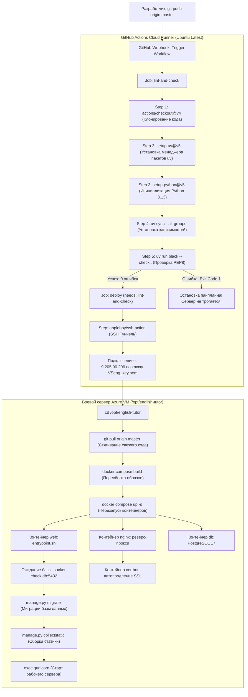

# Полный технический отчёт: Архитектура и разбор CI/CD пайплайна

## 1. Введение и обзор архитектуры

**CI/CD (Continuous Integration / Continuous Deployment)** — это процесс автоматизации тестирования, сборки и доставки программного обеспечения на сервер. В проекте **English Learning Platform** пайплайн построен на базе **GitHub Actions**, **Docker Compose** и **Azure Virtual Machine** (Ubuntu 24.04 LTS).

### Цели пайплайна:
1. **Гарантия качества кода (CI)**: предотвращение попадания некорректно отформатированного или синтаксически сломанного кода в продакшн.
2. **Автоматический релиз (CD)**: доставка изменений на живой сервер `vsenglish.me` за один шаг без необходимости ручного входа по SSH.
3. **Изоляция и воспроизводимость**: запуск сервисов в изолированных Docker-контейнерах, идентичных на всех машинах.

---

## 2. Диаграмма сквозного процесса (End-to-End Flow)



---

## 3. Построчный разбор `.github/workflows/deploy.yml`

Файл конфигурации workflow располагается по пути `.github/workflows/deploy.yml`.

```yaml
1: name: Deploy to Production
```
* **Назначение**: Человекочитаемое имя пайплайна, отображаемое во вкладке **Actions** в интерфейсе GitHub.

```yaml
3: on:
4:   push:
5:     branches:
6:       - main
7:       - master
```
* `on`: Декларация событий, при наступлении которых запускается пайплайн.
* `push`: Триггер срабатывает при отправке коммитов в удалённый репозиторий.
* `branches`: Список веток, за которыми ведётся наблюдение. Пайплайн запускается только при отправке коммитов в ветки `main` или `master`. Пуши в другие ветки (например, `feature/login`) не будут вызывать деплой на боевой сервер.

```yaml
9: jobs:
```
* Корневой блок, объединяющий задачи (Jobs). Каждая задача по умолчанию запускается в изолированной виртуальной машине.

---

### Задача 1: `lint-and-check` (Проверка качества)

```yaml
10:   lint-and-check:
11:     runs-on: ubuntu-latest
```
* `lint-and-check`: Уникальный идентификатор задачи.
* `runs-on: ubuntu-latest`: Указывает GitHub выделить виртуальную машину с актуальной версией Ubuntu Linux в облаке Microsoft Azure.

```yaml
12:     steps:
```
* Последовательность шагов, выполняемых внутри задачи.

```yaml
13:       - name: Checkout code
14:         uses: actions/checkout@v4
```
* **Действие**: Официальный action от GitHub.
* **Что делает**: Выполняет `git clone` репозитория на виртуальную машину GitHub Actions и переключается на коммит, вызвавший триггер. Без этого шага раннер не имеет доступа к коду проекта.

```yaml
16:       - name: Install uv
17:         uses: astral-sh/setup-uv@v5
18:         with:
19:           version: "latest"
```
* **Действие**: Экшен от создателей инструмента `uv` (Astral).
* **Что делает**: Скачивает и устанавливает высокопроизводительный бинарник `uv` в системный `PATH` виртуальной машины. Это ускоряет установку Python-пакетов в 10–50 раз по сравнению со стандартным `pip`.

```yaml
21:       - name: Set up Python
22:         uses: actions/setup-python@v5
23:         with:
24:           python-version: "3.13"
```
* **Действие**: Инициализация окружения языка Python.
* **Что делает**: Устанавливает на раннер CPython версии `3.13` (соответствует директиве `requires-python = ">=3.13"` в `pyproject.toml`).

```yaml
26:       - name: Install dependencies
27:         run: uv sync --all-groups
```
* **Что делает**: Читает `uv.lock` и устанавливает абсолютно точные версии всех зависимостей проекта, включая группу `dev` (в которой находится форматер `black`). Флаг `--all-groups` гарантирует, что инструменты тестирования и линтинга будут доступны.

```yaml
29:       - name: Run Black check
30:         run: uv run black --check .
```
* **Что делает**: Запускает форматер `Black` в режиме проверки (`--check`) по всему репозиторию.
* **Механика**: Если хотя бы в одном файле нарушены правила стиля PEP8 (неправильные отступы, длина строк, переносы), команда завершается с кодом ошибки `1`.
* **Результат**: Задача падает с ошибкой, и выполнение пайплайна **мгновенно прекращается**.

---

### Задача 2: `deploy` (Развёртывание на боевом сервере)

```yaml
32:   deploy:
33:     needs: lint-and-check
34:     runs-on: ubuntu-latest
```
* `needs: lint-and-check`: **Критический барьер качества (Quality Gate)**. Задача деплоя физически не начнется до тех пор, пока задача `lint-and-check` не завершится с кодом `0` (зелёный статус). Это защищает боевой сервер от выкатки сломанного кода.
* `runs-on: ubuntu-latest`: Выделяется виртуальная машина для выполнения команд развертывания.

```yaml
36:       - name: Deploy to Azure Server via SSH
37:         uses: appleboy/ssh-action@v1.0.3
38:         with:
39:           host: ${{ secrets.SERVER_HOST }}
40:           username: ${{ secrets.SERVER_USER }}
41:           key: ${{ secrets.SERVER_SSH_KEY }}
```
* `appleboy/ssh-action`: Проверенный open-source action для безопасного удаленного подключения по протоколу SSH.
* `${{ secrets.SERVER_HOST }}`: Подставляет скрытый секрет — публичный IP сервера (`9.205.90.206`).
* `${{ secrets.SERVER_USER }}`: Подставляет логин пользователя ОС (`azureuser`).
* `${{ secrets.SERVER_SSH_KEY }}`: Подставляет закрытый ключ RSA (`VSeng_key.pem`).
* **Безопасность**: GitHub Actions автоматически шифрует секреты через библиотеку *Libsodium* и маскирует их в логах сборки символами `***`.

```yaml
42:           script: |
43:             cd /opt/english-tutor
44:             git pull origin master
45:             docker compose -f docker-compose.prod.yml build
46:             docker compose -f docker-compose.prod.yml up -d
```
Блок удаленных команд, выполняемых последовательно на сервере Azure:

1. `cd /opt/english-tutor`: Переход в корневую директорию проекта на сервере.
2. `git pull origin master`: Запрос к GitHub и выкачивание свежих коммитов в локальный репозиторий сервера.
3. `docker compose -f docker-compose.prod.yml build`: Пересборка Docker-образа `web` с учётом нового исходного кода. Если зависимости (`pyproject.toml` / `uv.lock`) не менялись, Docker использует кэш слоев, и сборка занимает всего несколько секунд.
4. `docker compose -f docker-compose.prod.yml up -d`: Бесшовный перезапуск контейнеров в фоновом режиме (daemon). Docker заменяет только те контейнеры, чьи образы или конфигурации изменились, без простоя базы данных.

---

## 4. Построчный разбор `Dockerfile`

`Dockerfile` описывает рецепт создания неизменяемого контейнера для бэкенда Django.

```dockerfile
1: FROM python:3.13-slim
```
* Базовый образ: минималистичный дистрибутив Debian GNU/Linux с предустановленным Python 3.13. Занимает минимум места на диске и не содержит лишних уязвимых пакетов.

```dockerfile
3: ENV PYTHONDONTWRITEBYTECODE=1
4: ENV PYTHONUNBUFFERED=1
5: ENV UV_COMPILE_BYTECODE=1
6: ENV UV_LINK_MODE=copy
```
* `PYTHONDONTWRITEBYTECODE=1`: Запрещает Python создавать `.pyc` файлы в процессе выполнения (экономит I/O операции).
* `PYTHONUNBUFFERED=1`: Отключает буферизацию стандартных потоков вывода (`stdout` и `stderr`). Все логи приложения мгновенно попадают в команду `docker logs` в реальном времени.
* `UV_COMPILE_BYTECODE=1`: Указывает `uv` предкомпилировать байткод один раз на этапе сборки образа, ускоряя последующий старт приложения.
* `UV_LINK_MODE=copy`: Указывает `uv` копировать файлы пакетов вместо создания жестких ссылок (важно для совместимости со слоями Docker overlayfs).

```dockerfile
8: WORKDIR /app
```
* Создаёт рабочую папку `/app` внутри контейнера и делает её текущей.

```dockerfile
10: RUN apt-get update && apt-get install -y --no-install-recommends \
11:     ffmpeg \
12:     curl \
13:     libpq5 \
14:     && rm -rf /var/lib/apt/lists/*
```
* Установка системных бинарных библиотек:
  * `ffmpeg`: Критически необходим для работы библиотеки `yt-dlp` (объединение аудио и видео дорожек скачиваемых роликов в единый `.mp4`).
  * `curl`: Утилита для системных проверок и healthcheck.
  * `libpq5`: Системная C-библиотека клиента PostgreSQL, необходимая для работы адаптера `psycopg2-binary`.
  * `rm -rf /var/lib/apt/lists/*`: Удаление кэша пакетного менеджера для уменьшения финального размера Docker-образа.

```dockerfile
16: COPY --from=ghcr.io/astral-sh/uv:latest /uv /uvx /bin/
```
* **Multi-stage паттерн**: Копирует скомпилированные бинарники `uv` напрямую из официального образа Astral без необходимости ставить их через `pip`.

```dockerfile
18: COPY pyproject.toml uv.lock ./
19: RUN uv sync --frozen --no-dev --no-install-project
```
* **Оптимизация Docker-кэша**: Копируются *только* манифесты зависимостей до копирования кода.
* `uv sync --frozen --no-dev`: Устанавливает только продакшн-зависимости (без `black`, тестов и dev-пакетов). Если разработчик изменил только HTML-шаблон или view-функцию, этот шаг берется из кэша мгновенно.

```dockerfile
21: COPY . .
```
* Копирование всего исходного кода проекта внутрь контейнера.

```dockerfile
23: RUN chmod +x /app/entrypoint.sh
```
* Установка прав на исполнение для стартового скрипта контейнера.

```dockerfile
25: ENV PATH="/app/.venv/bin:$PATH"
```
* Добавление созданного `uv` виртуального окружения в системный `PATH`. Теперь команды `python`, `manage.py` и `gunicorn` вызываются напрямую без активации окружения.

```dockerfile
27: WORKDIR /app/english_platform
```
* Переключение в каталог Django-проекта (где лежит `manage.py` и модуль `config`).

```dockerfile
29: EXPOSE 8000
```
* Информационная директива, документирующая, что веб-сервер слушает порт 8000.

```dockerfile
31: ENTRYPOINT ["/app/entrypoint.sh"]
32: CMD ["gunicorn", "config.wsgi:application", "--bind", "0.0.0.0:8000", "--workers", "3", "--timeout", "120"]
```
* `ENTRYPOINT`: Скрипт, который перехватывает запуск контейнера (выполняет миграции и статику).
* `CMD`: Основной процесс, передаваемый в `entrypoint.sh`. Запускает продакшн WSGI-сервер `gunicorn` с 3 рабочими процессами (воркерами) и тайм-аутом 120 секунд.

---

## 5. Построчный разбор `entrypoint.sh`

Скрипт отвечает за инициализацию перед запуском сервера:

```sh
1: #!/bin/sh
2: set -e
```
* `set -e`: Немедленно завершает работу скрипта при возникновении любой ошибки.

```sh
4: until python -c "import socket; s = socket.socket(); s.connect(('${POSTGRES_HOST:-db}', int('${POSTGRES_PORT:-5432}'))); s.close()" 2>/dev/null; do
5:   sleep 1
6: done
```
* **Механизм ожидания БД (Healthcheck loop)**:
  * В Docker Compose сервисы стартуют параллельно. PostgreSQL может запускаться 3–5 секунд.
  * Если Django сразу попытается выполнить миграции, приложение упадет с ошибкой `Connection Refused`.
  * Этот цикл каждую секунду проверяет открытие TCP-сокета к порту базы данных. Цикл завершается только тогда, когда PostgreSQL реально готов принимать сетевые соединения.

```sh
8: python manage.py migrate --noinput
```
* Автоматически применяет все новые миграции схемы БД. Флаг `--noinput` запрещает запрашивать интерактивный ввод.

```sh
9: python manage.py collectstatic --noinput
```
* Собирает все статические файлы (CSS, JS, изображения) из всех приложений в единую директорию `STATIC_ROOT` (`staticfiles`), откуда их напрямую отдает Nginx.

```sh
11: exec "$@"
```
* **Паттерн замещения процесса (Process Replacement)**:
  * Команда `exec` подменяет текущий процесс шелла `/bin/sh` на процесс `gunicorn`, переданный в `CMD`.
  * Это делает Gunicorn главным процессом (**PID 1**) контейнера.
  * Благодаря этому сигналы остановки операционной системы (`SIGTERM`, `SIGINT`) передаются напрямую Gunicorn, обеспечивая корректное завершение открытых запросов (*Graceful Shutdown*).

---

## 6. Взаимодействие сервисов в `docker-compose.prod.yml`

* **`db` (Postgres 17-alpine)**:
  * Изолированная база данных. Хранит данные в именованном томе `pg_data`, гарантируя сохранение данных между пересборками.
* **`web` (Django + Gunicorn)**:
  * Не открывает порты наружу (`expose: 8000`), доступен только внутри внутренней Docker-сети.
  * Подключает `static_data` и `media_data` для передачи файлов в Nginx.
* **`nginx` (Обратный прокси-сервер)**:
  * Единственный сервис, смотрящий в интернет через порты `80` (HTTP) и `443` (HTTPS).
  * Самостоятельно отдает статику (`/static/`) и загруженные видео/субтитры (`/media/`) с диска, минуя Python-код, что обеспечивает максимальную скорость и поддержку byte-range запросов для видеоплеера.
  * Запросы к страницам сайта и API перенаправляет во внутренний контейнер `web:8000`.
* **`certbot` (Демон обновления SSL)**:
  * Работает в цикле: раз в 12 часов проверяет срок действия сертификатов Let's Encrypt и автоматически обновляет их до истечения срока.

---

## 7. Безопасность и защита от сбоев (Rollback)

1. **Что происходит при сломанном коммите**:
   * Если в коде есть синтаксическая ошибка или несоблюдение стиля, шаг `lint-and-check` в GitHub Actions завершится сбоем.
   * Шаг `deploy` **не запустится**.
   * Боевой сервер Azure продолжит стабильно работать на предыдущей рабочей версии.
2. **Как выполнить откат (Rollback)**:
   * Если непредвиденный баг обнаружился уже в проде:
     ```bash
     git revert HEAD
     git push origin master
     ```
   * GitHub Actions автоматически применит откат, стянет предыдущее состояние и перезапустит контейнеры без ручного вмешательства в сервер.
